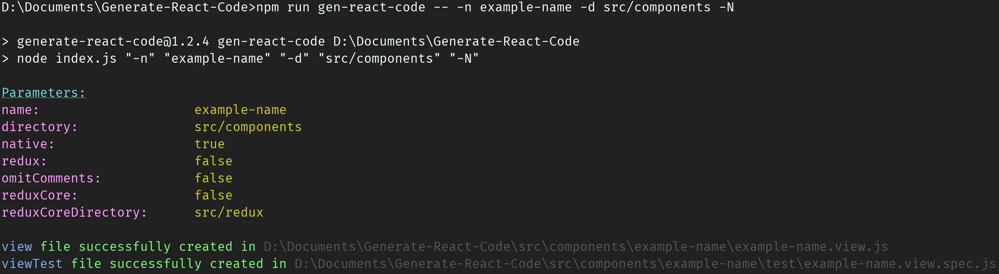

Generate React Code
===================

[](https://travis-ci.org/JPStrydom/Generate-React-Code)
[](https://coveralls.io/github/JPStrydom/Generate-React-Code?branch=master)
[](https://github.com/prettier/prettier)

[](http://standardjs.com)

This project utilises a scaffolding framework which generates React or React-Native code along with all the essential
test code... Because who likes writing that themselves?!

Additionally, it can be used to generate Redux code conforming to the [Redux ducks pattern](https://github.com/erikras/ducks-modular-redux) - and it can also be used to 
generate the Redux core files needed for React-Redux projects (`store`, `root-reducer`, and `action-creator`).

This generated code conforms to the [Air BnB style guide's](https://github.com/airbnb/javascript) naming and coding-style
conventions, and it is thus highly recommended to make use of this tool when creating new React or React-Redux components.

This package also allows users to add a configuration file containing default parameters. That way users would not have to specify these parameters every time they wish to generate code.

_IMPORTANT NOTE:_
* _This package assumes the use of [__sass__](https://github.com/sass/sass) for React web projects._
* _This package assumes the use of [__Redux-Thunk__](https://github.com/gaearon/redux-thunk) as a Redux middleware._
* _This package assumes the use of [__enzyme__](https://github.com/airbnb/enzyme) and [__jest__](https://github.com/facebook/jest) for React testing._

## Installation

To install and save this npm package, navigate to your project's root directory in console and execute the following command:
```shell
npm install generate-react-code --save-dev
```

Then add the following script to your `packages.json` file:

```json
{
  "scripts": {
    "gen-react-code": "generate-react-code"
  }
}
```

## Generation Command

The following command can be used to generate code:
```shell
npm run gen-react-code -- -n example-component -d src/example/dir -r
```

## Command Parameter Description:

|Parameter|Description|Default Value|
|---------|-----------|-------|
| **`-n`** OR<br>**`--name`**                 | This is the lower kebab case name of the feature/component you would like to generate (e.g. `kebab-example-name`).                                                                   | **`kebab-example-name`** |
| **`-d`** OR<br>**`--directory`**            | This is the relative directory where the generated component will be placed (e.g `src/components`).                                                                                  | **`src/components`**     |
| **`-N`** OR<br>**`--native`**               | If you wish to generate code for React-Native, add this parameter - else React web code will be generated.                                                                           | **`false`**              |
| **`-r`** OR<br>**`--redux`**                | If you wish to generate Redux code in the duck pattern, add this parameter - else regular React code will be generated.                                                              | **`false`**              |
| **`-o`** OR<br>**`--omit-comments`**        | If you wish to hide the comments within the generated files, add this parameter - else descriptive comments will be left in the generated code.                                      | **`false`**              |
| **`-R`** OR<br>**`--redux-core`**           | If you would like to generate the Redux core files (`store`, `root-reducer`, and `action-creator`), add this parameter. These files are used to connect your application with Redux. | **`false`**              |
| **`-D`** OR<br>**`--redux-core-directory`** | This is the relative directory where the generated Redux core file will be placed (e.g `src/redux`). It is recommended to leave this as the default.                                 | **`src/redux`**          |
| **`-h`** OR<br>**`--help`**                 | Output help usage information.                                                                                                                                                       |                          |

## Configuration File

If you wish to store default parameters for your project, you'll have to add an optional `grcc.json` (_generate react code config_) file to your project's root directory.
The file must have the following structure:
```json
{
  "native": true,
  "redux": true,
  "omitComments": true
}
```

_IMPORTANT NOTE:_
* _All these parameters are `false` by default. The parameters you wish to remain so, may be omitted from the file._
* _If you specify any of these parameters in your generation command, the generation command parameters will take priority over the ones in the `grcc.json` file._
* _The `grcc.json` file is completely optional and does not have to be added._


## Generated Output Examples

### React Example

Given the following example code generation command:
```shell
npm run gen-react-code -- -n example-component -d src/components
```
The following file/folder structure will be generated (_take note that the `example-component` directory is generated without you having to specify it explicitly_):
```
project
└───src
    └───components
        └───example-component
            │   example-component.view.js
            │   _example-component.styles.scss
            └───test
                │   example-component.view.spec.js
```
Within these files the majority of the React code will be completed for you - which contains detailed comments on how to add your
functionality and general best practices.

_IMPORTANT NOTE:_
* _Remember to add generated style sheets to the main style sheet, which is usually located in `src/index.scss`_


### React Example With Config

Given the following `grcc.json` config file:
```json
{
 "native": true,
 "redux": true
}
```
And given the following example code generation command:
```shell
npm run gen-react-code -- -n example-component -d src/components
```
The following file/folder structure will be generated (_take note that the `example-component` directory is generated without you having to specify it explicitly_):
```
project
└───src
    └───components
        └───example-component
            │   example-component.view.js
            │   _example-component.styles.scss
            └───test
                │   example-component.view.spec.js
```
Within these files the majority of the React code will be completed for you - which contains detailed comments on how to add your
functionality and general best practices.

_IMPORTANT NOTE:_
* _Remember to add generated style sheets to the main style sheet, which is usually located in `src/index.scss`_


### React Native Example

Given the following example code generation command:
```shell
npm run gen-react-code -- -n example-component -d src/components -N
```
The following file/folder structure will be generated (_take note that the `example-component` directory is generated without you having to specify it explicitly_):
```
project
└───src
    └───components
        └───example-component
            │   example-component.view.js
            └───test
                │   example-component.view.spec.js
```
Within these files the majority of the React-Native code will be completed for you - which contains detailed comments on how to add your
functionality and general best practices.




### React With Redux Example

Given the following example code generation command:
```shell
npm run gen-react-code -- -n example-component -d src/components -r
```
The following file/folder structure will be generated (_take note that the `example-component` directory is generated without you having to specify it explicitly_):
```
project
└───src
    └───components
        └───example-component
            │   example-component.container.js
            │   example-component.reducer.js
            │   example-component.view.js
            │   _example-component.styles.scss
            └───test
                │   example-component.container.spec.js
                │   example-component.reducer.spec.js
                │   example-component.view.spec.js
```
Within these files the majority of the React web code will be completed for you - which contains detailed comments on how to add your
functionality and general best practices.

_IMPORTANT NOTE:_
* _Remember to add generated reducers to the root reducer, which is usually located in `src/redux/root-reducer.js`_
* _Remember to add generated style sheets to the main style sheet, which is usually located in `src/index.scss`_


### Redux Core Files Example

Given the following example code generation command:
```shell
npm run gen-react-code -- -R
```
The following file/folder structure will be generated (_take note that adding the `-R` parameter will cause only the
core files to be generated, irrespective of the other parameters_):
```
project
└───src
    └───redux
        │   store.js
        │   root-reducer.js
        └───action-creator
            │   build-action-type.js
            │   create-action.js
            └───test
                │   build-action-type.spec.js
                │   create-action.spec.js
```
Within these files the majority of the React-Redux core code will be completed for you - which contains detailed comments on how to add your
reducers and general best practices.

_IMPORTANT NOTE:_
* _Remember to add your `store` to your Redux `Provider` where you're rendering your main app, which is usually located in `src/index.js`_


## Extra Material 
A great example on how to use `generate-react-code` can be found [here](https://github.com/zulucoda/generate-react-code-test) (courtesy of [ZuluCoda](https://github.com/zulucoda)).
